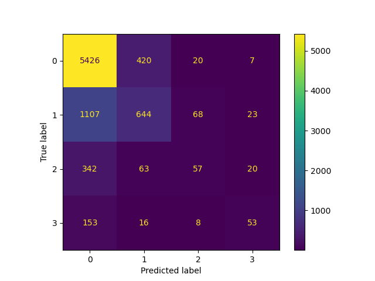

# Deep Learning model for AKI Prediction on MIMIC-III

Aki-Predictor is a set of python script running deep learning model to predict Acute Kiden Injuries during the first 7 days of stay in ICU. The proposed model was tested on MIMIC-III database.

We developed our model based on 83 features referring to routinely collected clinical parameters.  
The features includes demographics data, vital signs measured at the bedsidesuch as heart rate, arterial blood pressure, respiration rate, etc. laboratory test results such 
as blood urea nitrogen, hemoglobin, white blood count, etc. average of urine output, theminimum  value  of  estimated  glomerular  filtration  rate  (eGFR)  and  creatinine.
We also included co-morbidities such as congestive heart failure,  hypertension,  diabetes,  etc.

## How to run

1. First create a conda environment based on the [environment.yml](environment.yml) file:
   ```
   conda env create -f environment.yml
   conda activate aki-predictor 
   ```
2. Make a copy of .env.template named .env: `cp .env.template .env`
   
   (If the .env file is missing, a database connection to localhost will be used)
3. Fill in the values.
4. Set the environment variables using: `. .env`
5. Execute one of the following commands to extract AKI patient data from the MIMIC III or eICU databases:
   - `python aki-postgres.py --dbname mimiciii`
   - `python aki-postgres.py --dbname eicu`
   
   This will generate parquet files of all responses in [data/queried](./data/queried)

(In order to explore if this data fetching of eicu data was succesful in comparison with the (proven by ExaScience) mimic-iii fetch, we've added a jupyter notebook to explore the data and create images for all parameters in which mimic data is compared with eicu data:
[jupyter notebook](data_exploration.ipynb).)

6. Execute one of the following commands to clean and preprocess the csv files generated from the data extraction step:
   - `python aki_preprocess.py --dbname mimiciii`
   - `python aki_preprocess.py --dbname eicu`
7. To run the machine learning model run according to the database:
-  `python aki_ml.py --dbname mimiciii`
-  `python aki_ml.py --dbname eicu`


The aki_ml.py script contain the following functions:

* run_aki_model: predicts wether a patient will develop AKI within the first 7 days of its stay and which stage of AKI it is according to the KIDIGO guidelines.
* cluster_ethnicity: subsets the data  by  ethnicity:  train  on  "Caucasian"  (all variants),  predict  for  all  other  ethnicities.   
* change_data_size: does random subsampling of available training data

## AKI-ML output

We'll output some files, depending on the timestamp and the database being accessed. This allows for easier comparison between different runs as well as different datasets.

In [./data/<database_name>/model/weights](./data/mimiciii/model/weights/) you'll find the weights for the model calculated for this database at a certain timestamp.

In [./data/<database_name>/model/metrics](./data/mimiciii/model/metrics/) you'll find the accompanying metrics for this model.

e.g. a confusion matrix:  


When training the model, we can watch and evaluate it's progress by launching a tensorboard pointing at the log directory (e.g. for mimic-III database)

```bash
tensorboard --logdir ./data/mimic/model/logs/
```

if this succefully launches in terminal, open your browser and go to the page displayed in the terminal text.
